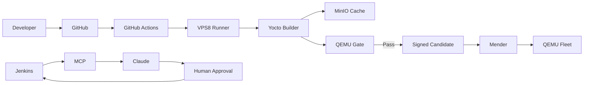

# Architecture Overview

## Purpose

The system separates source control, orchestration, build execution, cache, virtual validation, release packaging, OTA control, fleet execution, and AI diagnostics. GitHub Actions is authoritative for CI; Jenkins is a parallel diagnostic demonstration. The tested artifact is promoted immutably.

## Key Decisions

- Build and release implementation lives in repository scripts, not CI-specific logic.
- GitHub Actions is authoritative for continuous build.
- Jenkins exists for the enterprise diagnostic story and cannot promote OTA releases.
- QEMU is a virtual validation gate, not physical-board certification.
- Promotion uses the exact tested artifact.
- AI remains advisory and least-privileged.

## Failure Handling

Failures must be classified, retained as evidence, and prevented from silently producing a release. Timeouts, cleanup, retries, and escalation are component responsibilities.

## Evolution

Any move to shared Project A infrastructure must preserve artifact identity, approval boundaries, least privilege, and evidence continuity.
